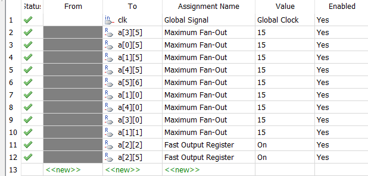
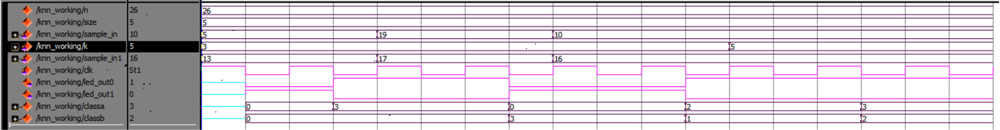
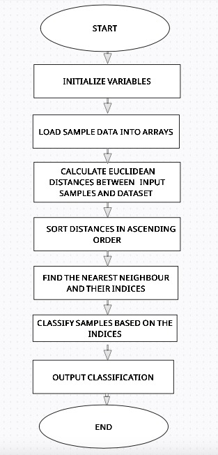

# FPGA-Based Hardware Accelerator for K-Nearest Neighbors (KNN)

## Overview
This repository contains the implementation of a hardware-accelerated K-Nearest Neighbors (KNN) algorithm using Verilog on an FPGA. The project includes performance and timing analysis using Quartus, and a Python-based software implementation on Google Colab for comparison.

## Features
- **FPGA Design**: Hardware implementation of KNN in Verilog.
- **Python Baseline**: Software implementation in Python for comparison.
- **Performance Analysis**: Timing analysis and performance comparison between FPGA and software-based implementations.
- **Optimizations**:
  - Global clock signal assignment.
  - Maximum fan-out value adjustments.
  - Integration of Synopsys Design Constraints (SDC) to optimize timing.

## Tools and Technologies

### Hardware Development
- **Verilog**: For FPGA design.
- **Quartus Prime**: For synthesis and timing analysis.
- **ModelSim**: For functional simulation and verification.

### Software Development
- **Python**: For KNN implementation on Google Colab.

### Other Tools
- **TimeQuest Analyzer**: For timing analysis.
- **Assignment Editor**: For signal optimization in Quartus.

## Implementation Details

### 1. Verilog Design
The KNN algorithm is implemented in Verilog, with modules handling:
- Distance calculation
- Sorting
- Classification

### 2. Assignment Editor Modifications
Optimizations performed include:
- Declaring the clock signal as a global signal.
- Assigning maximum fan-out values to specific registers to enhance performance and eliminate timing violations.

### 3. SDC File Integration
An SDC file was created to:
- Define clock frequency.
- Set input and output delays.
- Resolve negative slack and timing violations.

### 4. Timing Analysis
- **Tool Used**: TimeQuest Analyzer in Quartus.
- **Analysis Goals**:
  - Evaluate setup and hold times.
  - Validate performance improvements.

### 5. Python Implementation
A Python-based implementation of KNN was executed on Google Colab to serve as a baseline for timing comparison.

## Results
- **Quartus Timing Analysis**:
  - Showed significant improvements in timing performance using FPGA acceleration.
- **Google Colab**:
  - Provided baseline timing results for comparison.

## How to Run

### Verilog Implementation
1. Open the [Verilog code](verilog_implementation/hardware_accelerator_knn.v) in Quartus Prime.
2. Add the [provided SDC file](verilog_implementation/SDC_code.txt) to the project.
3. Apply the required assignment editor features.
4. Run timing analysis using TimeQuest Analyzer.

### Python Implementation
1. Run the [Python script](python_implementation/hardware_accelerator_knn.py).

### Results and Flow Diagrams
1. Fan Out
- 
2. Assignment Editor
- 
3. ModelSim
- 

4. Flowchart
- 
5. Test Case Clasification
- 

## Future Work
- Explore advanced FPGA design optimizations to reduce latency further.
- Expand implementation for multi-class classification.
- Integrate additional machine learning algorithms for hardware acceleration.
